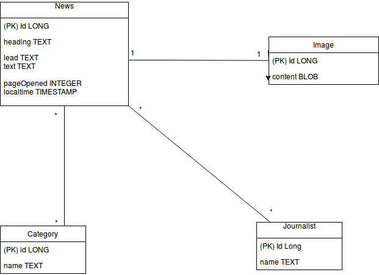

## Topic

An application where an user can add News, view and edit them. An user can also add journalists and categories to the news.
When the user goes to the front page he/she is able to see the 5 most newest news, their leadings and images. An user can also filter results by categories
or with how much clicks a single piece of new has had in the previous week. 

The application is running on Heroku server using its own PostgreSQL -database. 
The github repository is also included with codecov.io badge, Travis build status and Codebeat badge. 

The program can be found in address: https://wepaspringnews.herokuapp.com/news/trending

### Structure

### Shortages

Application testing is not fulfilled in a good manner due to pretty strict time limits for the project. I had major issues for testing database repository classes therefore they aren’t really tested at all. 

Application is also missing the feature for creating new users and the way to log in is not very logical either. 

One of the demands was do the news listing so that they are suppoused to be in descending order in a way that the first article is the most read in the previous week. That feature is also missing due to time limits. So now that page is only listing all the news depending on how much they have been read. 
